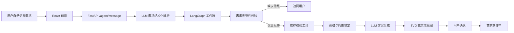

# FloraAgent 定制花束智能体

FloraAgent 是一个面向鲜花定制场景的 AI Agent 应用。项目不做完整电商平台，而是聚焦“用户自然语言提出定制需求后，Agent 完成需求解析、库存校验、多轮追问、方案生成、花束预览、用户确认和商家制作单生成”的核心业务闭环。

## 项目亮点

- **LLM 结构化解析**：接入硅基流动 SiliconFlow 的 DeepSeek 模型，将用户自然语言解析为稳定 JSON。
- **LangGraph 工作流**：使用状态图组织需求校验、信息追问、库存检查、方案生成和用户确认。
- **工具调用约束**：库存校验、替代推荐、价格计算由后端工具完成，避免模型生成不可落地方案。
- **LLM 方案生成**：在花材、数量、包装和价格被锁定后，让模型生成更自然的方案标题、风格说明和花语表达。
- **Agent Trace 面板**：前端展示本轮经过的 LangGraph 节点、LLM 调用、工具调用和兜底状态。
- **可演示兜底机制**：LLM 调用失败时自动回退到规则解析和确定性方案生成，保证 Demo 可运行。
- **业务闭环完整**：从需求输入到商家制作单输出，适合 AI 应用开发岗简历展示。

## 技术栈

- 前端：React + TypeScript + Vite
- 后端：Python + FastAPI
- Agent 编排：LangGraph
- LLM：OpenAI Python SDK + OpenAI-compatible APIs
- 模型服务：SiliconFlow / DeepSeek
- 数据：本地 JSON 模拟库存
- 预览图：基于花材清单、包装偏好和价格生成 SVG 花束示意图

## 架构图



## 核心流程

1. 用户输入定制花束需求。
2. LLM 将自然语言解析成结构化需求字段。
3. LangGraph 判断信息是否完整。
4. 信息缺失时进入追问节点。
5. 信息完整后调用库存校验工具。
6. 库存不足时生成替代花材建议。
7. 后端锁定花材、数量、包装和价格。
8. LLM 生成方案标题、风格说明和花语解释。
9. 后端生成 SVG 花束示意图。
10. 用户确认后生成商家制作单。

## 快速启动

### 后端

```bash
cd backend
python -m venv .venv
.venv\Scripts\activate
pip install -r requirements.txt
uvicorn app.main:app --reload --port 8000
```

后端接口文档：

```text
http://127.0.0.1:8000/docs
```

### 前端

```bash
cd frontend
pnpm install
pnpm run dev
```

前端页面：

```text
http://127.0.0.1:5173/
```

## LLM 配置

在 `backend/.env` 中填写硅基流动 API 配置：

```text
LLM_API_KEY=你的硅基流动 API Key
LLM_BASE_URL=https://api.siliconflow.cn/v1
LLM_MODEL=deepseek-ai/DeepSeek-V3
```

`.env` 已加入 `.gitignore`，不要提交到 GitHub。

如果没有配置 API Key，项目仍可运行，只是前端会显示 `规则解析兜底`。

## 演示输入

```text
我想送女朋友一束温柔一点的花，预算 200 元，想要 6 枝粉玫瑰，加一点满天星，包装高级一点。
```

系统会返回：

- 结构化需求
- 库存校验结果
- 花束设计方案
- SVG 花束示意图
- Agent 执行轨迹
- 确认下单按钮
- 商家制作单

## 文档

- [架构与工作流说明](docs/architecture.md)
- [LLM 接入说明](docs/llm-integration.md)
- [MVP 接口设计](docs/mvp-api.md)
- [简历与面试讲解稿](docs/resume-interview.md)

