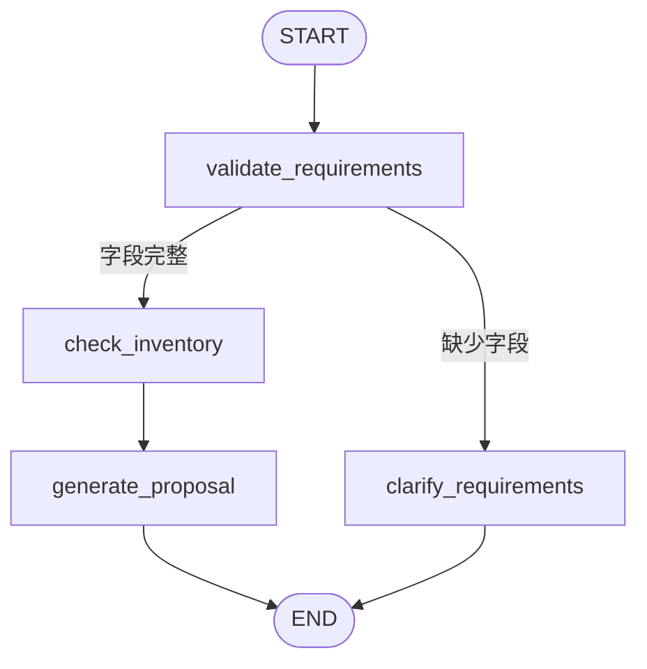

# 架构与工作流说明

## 项目定位

FloraAgent 是一个定制花束 Agent 工作流系统。它的目标不是实现完整商城，而是展示 AI 应用开发中常见的能力组合：LLM 结构化解析、Agent 状态流转、工具调用、业务约束校验、人机确认和结果交付。

## 模块划分

### 前端

- `ChatPanel`：用户输入需求，与 Agent 多轮交互。
- `InventoryPanel`：展示商家当前可用花材库存。
- `Agent Trace`：展示本轮请求经过的节点、工具和 LLM 调用状态。
- `DesignPreview`：展示花束方案、SVG 示意图和价格。
- `OrderDraftPanel`：用户确认后展示商家制作单。

### 后端

- `agent_workflow.py`：LangGraph 工作流入口。
- `llm_parser_service.py`：调用 LLM 进行需求结构化解析。
- `inventory_service.py`：库存查询和替代花材推荐。
- `llm_proposal_service.py`：调用 LLM 润色花束方案。
- `image_service.py`：根据最终方案生成 SVG 花束示意图。
- `models.py`：请求、响应、库存、方案、制作单和 Trace 数据模型。

## LangGraph 节点



## Agent Trace 示例

```text
parse_requirement      llm / success
validate_requirements  control / success
check_inventory        tool / success
price_and_constraints  tool / success
generate_proposal      llm / success
generate_preview       tool / success
```

## 设计原则

- LLM 负责理解和表达，不负责决定库存和价格。
- 库存、数量、替代花材和价格由后端工具控制。
- 用户确认是关键人机协作节点，系统不会自动生成最终订单。
- LLM 失败时走规则兜底，保证项目可以稳定演示。

## 数据流

1. 前端发送用户消息到 `/agent/message`。
2. 后端读取或创建 session 状态。
3. LLM 尝试解析用户需求。
4. LangGraph 推进节点。
5. 工具查询库存并计算价格。
6. LLM 在业务约束内生成方案文案。
7. 后端返回方案、示意图、Trace 和下一步动作。
8. 用户确认后生成制作单。

